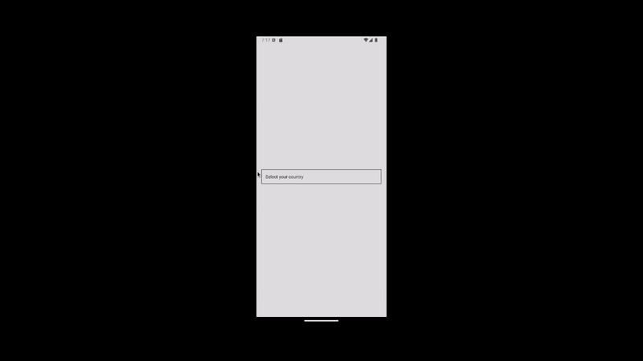
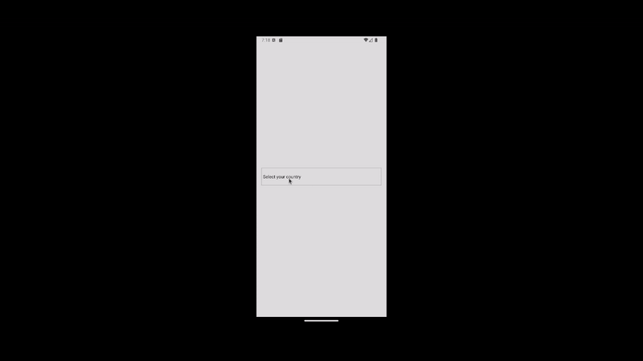

# react-native-expo-modal-select

This is customizable Modal Select for your React Native and Expo application.

## Installation

```
npm install react-native-expo-modal-select
```

or

```
yarn add react-native-expo-modal-select
```

## Basic usage

```js
import React, { useState } from 'react';
import { StyleSheet, View } from 'react-native';
import ModalSelect, { type Item } from 'react-native-expo-modal-select';

const countries: Item[] = [
  {
    label: 'Brazil',
    value: 'brazil',
  },
  {
    label: 'EUA',
    value: 'eua',
  },
  {
    label: 'Canada',
    value: 'canada',
  },
];

export default function Select() {
  const [country, setCountry] = useState('');
  return (
    <View style={styles.container}>
      <View style={styles.modalWrapper}>
        <ModalSelect
          placeholder="Select your country"
          items={countries}
          value={country}
          onChange={(value) => setCountry(value)}
        />
      </View>
    </View>
  );
}

const styles = StyleSheet.create({
  container: {
    flex: 1,
    justifyContent: 'center',
    backgroundColor: '#ddd',
    padding: 16,
  },
  modalWrapper: {
    borderWidth: 1,
    borderColor: '#111',
    borderStyle: 'solid',
    padding: 12,
  },
});
```



## Advanced usage
  **ModalSelect** allows you to customizable your component by passing custom components on props to it.

```js
import React, { useState } from 'react';
import { Pressable, StyleSheet, Text, View } from 'react-native';
import ModalSelect, {
  type CloseModalComponentProps,
  type Item,
  type ModalHeaderComponentProps,
  type ModalItemComponentProps,
  type PressableComponentProps,
  type EmptyIndicatorComponentProps,
} from 'react-native-expo-modal-select';

const countries: Item[] = [
  {
    label: 'Brazil',
    value: 'brazil',
  },
  {
    label: 'EUA',
    value: 'eua',
  },
  {
    label: 'Canada',
    value: 'canada',
  },
];

const renderPressableComponent = ({
  text,
  onOpen,
}: PressableComponentProps) => {
  return (
    <Pressable style={styles.pressable} onPress={onOpen}>
      <Text>{text}</Text>
    </Pressable>
  );
};

const renderCloseModalComponent = ({ onClose }: CloseModalComponentProps) => {
  return (
    <Pressable onPress={onClose}>
      <Text>close</Text>
    </Pressable>
  );
};

const renderModalHeaderComponent = ({
  title,
  onCancel,
  onClose,
}: ModalHeaderComponentProps) => {
  return (
    <View style={styles.header}>
      <Pressable
        onPress={onClose}
        style={[styles.button, { backgroundColor: 'green' }]}
      >
        <Text>close</Text>
      </Pressable>
      <Text>{title}</Text>
      <Pressable
        onPress={onCancel}
        style={[styles.button, { backgroundColor: 'blue' }]}
      >
        <Text>cancel</Text>
      </Pressable>
    </View>
  );
};

const renderEmptyIndicatorComponent = ({
  text,
}: EmptyIndicatorComponentProps) => {
  return (
    <View style={styles.emptyContainer}>
      <Text>{text || 'empty message'}</Text>
    </View>
  );
};

const renderModalItemComponent = ({
  item,
  index,
  focused,
  onSelect,
}: ModalItemComponentProps) => {
  return (
    <Pressable
      style={[styles.item, { backgroundColor: focused ? 'blue' : 'white' }]}
      onPress={onSelect}
    >
      <Text>
        {index} - {item.label}
      </Text>
    </Pressable>
  );
};

export default function Advanced() {
  const [country, setCountry] = useState('');
  return (
    <View style={styles.container}>
      <ModalSelect
        placeholder="Select your country"
        items={countries}
        value={country}
        onChange={(value) => setCountry(value)}
        pressableComponent={renderPressableComponent}
        modalItemComponent={renderModalItemComponent}
        closeModalComponent={renderCloseModalComponent}
        modalHeaderComponent={renderModalHeaderComponent}
        emptyIndicatorComponent={renderEmptyIndicatorComponent}
      />
    </View>
  );
}

const styles = StyleSheet.create({
  container: {
    flex: 1,
    justifyContent: 'center',
    backgroundColor: '#ddd',
    padding: 16,
  },

  emptyContainer: {
    flex: 1,
    justifyContent: 'center',
    alignItems: 'center',
  },
  header: {
    flexDirection: 'row',
    alignItems: 'center',
    justifyContent: 'space-between',
    height: 56,
    padding: 16,
    backgroundColor: '#ccc',
  },
  button: {
    height: 32,
    paddingHorizontal: 8,
    justifyContent: 'center',
  },
  text: {
    color: 'white',
  },
  pressable: {
    borderColor: '#aaa',
    borderWidth: 1,
    borderStyle: 'solid',
    height: 56,
    justifyContent: 'center',
    paddingHorizontal: 4,
  },
  item: {
    height: 56,
    padding: 16,
    borderColor: '#aaa',
    borderBottomWidth: 1,
  },
});

```


## Reference

### testID

id for testing

| Type   | Required | Default   |
| ------ | -------- | --------- |
| string | No       | undefined |

---

### items

array of `Item` that will be represented in modal as all the options that could be selected

| Type  | Required | Default |
| ----- | -------- | ------- |
| array | Yes      | []      |

---

### value

selected item in modal select

| Type   | Required | Default |
| ------ | -------- | ------- |
| string | Yes      |         |

---

### placeholder

text that will be displayed inside the touchable

| Type   | Required | Default   |
| ------ | -------- | --------- |
| string | No       | undefined |

---

### closeModalText

style object for modal cancel button text

| Type   | Required | Default |
| ------ | -------- | ------- |
| string | No       | Back    |

---

### cancelTouchableText

text that will be displayed inside the cancel touchable

| Type   | Required | Default |
| ------ | -------- | ------- |
| string | No       | Cancel  |

---

### emptyIndicatorText

text that will be displayed inside the empty indicator

| Type     | Required | Default                                  |
| -------- | -------- | ---------------------------------------- |
| function | Yes      | Sorry, there is nothing to be shown here |

---

### closeModalComponent

component for closing select modal

| Type            | Required | Default   |
| --------------- | -------- | --------- |
| React Component | No       | undefined |

---

### cancelModalComponent

component for canceling select modal

| Type            | Required | Default   |
| --------------- | -------- | --------- |
| React Component | No       | undefined |

---

### pressableComponent

component for pressing to open the select modal

| Type            | Required | Default   |
| --------------- | -------- | --------- |
| React Component | No       | undefined |

---

### modalHeaderComponent

component for the modal select header

| Type            | Required | Default   |
| --------------- | -------- | --------- |
| React Component | No       | undefined |

---

### emptyIndicatorComponent

component to indicate when modal select is empty

| Type            | Required | Default   |
| --------------- | -------- | --------- |
| React Component | No       | undefined |

---

### modalItemComponent

component for each item on modal select

| Type            | Required | Default   |
| --------------- | -------- | --------- |
| React Component | No       | undefined |

## Contributing

See the [contributing guide](CONTRIBUTING.md) to learn how to contribute to the repository and the development workflow.

## License

MIT

---

Made with [create-react-native-library](https://github.com/callstack/react-native-builder-bob)
